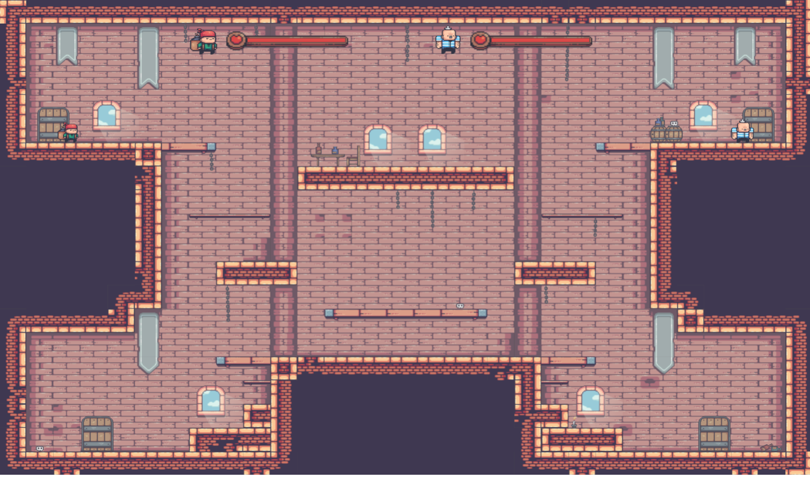

# **Bomb's Away!**

_Bomb's Away!_ is a 2D platform fighting game developed using the Godot game engine. This game was created for my final project in my _Introduction to 3D Game Graphics_ class at IUPUI. The class ended up focusing on other general video game development concepts rather than 3D game graphics such as pathfinding algorithms, designing game engines, 2D graphics, sprite animations, and in-game physics. We then learned how these concepts can be applied through the Godot game engine, leading to us being given free rein to design and develop any game we could create with either Godot or any other engine of our choosing or creation. 

## Building and Running the Game
The game can be built for MacOS, Windows, or a web browser by exporting a release build of the game using the Godot editor. Otherwise, a MacOS build can be found in the "./Builds/mac-builds" directory, and a web version can be run using a local server hosting the latest build in the "./Builds/web-builds" directory.

## How to Play
_Bomb's Away_ is a two-player platform fighting game, where the goal is to bring your opponent's health bar down to empty. Each player gets one bomb at a time to damage their opponent. Players can place their bombs around the map and detonate it when their opponent is near. If the opponent is within the blast radius of the bomb, they take damage.

## Controls
### Player 1 – Keyboard or Gamepad 1:
Walk left -> “a” key or left on left joystick
Walk right -> “d” key or right on left joystick
Jump -> “w” or “a” on xbox and “x” on playstation
Set bomb -> “c” or “x” on xbox and “square” on playstation
Detonate bomb -> “v” or “b” on xbox and “circle” on playstation

### Player 2 – Keyboard or Gamepad 2:
Walk left -> “left arrow” key or left on left joystick
Walk right -> “right arrow” key or right on left joystick
Jump -> “up arrow” or “a” on xbox and “x” on playstation
Set bomb -> “o” or “x” on xbox and “square” on playstation
Detonate bomb -> “p” or “b” on xbox and “circle” on playstation

## Credits
All assets and animations were created by [Pixel Frog](https://pixelfrog-assets.itch.io/) on Itch.io.
